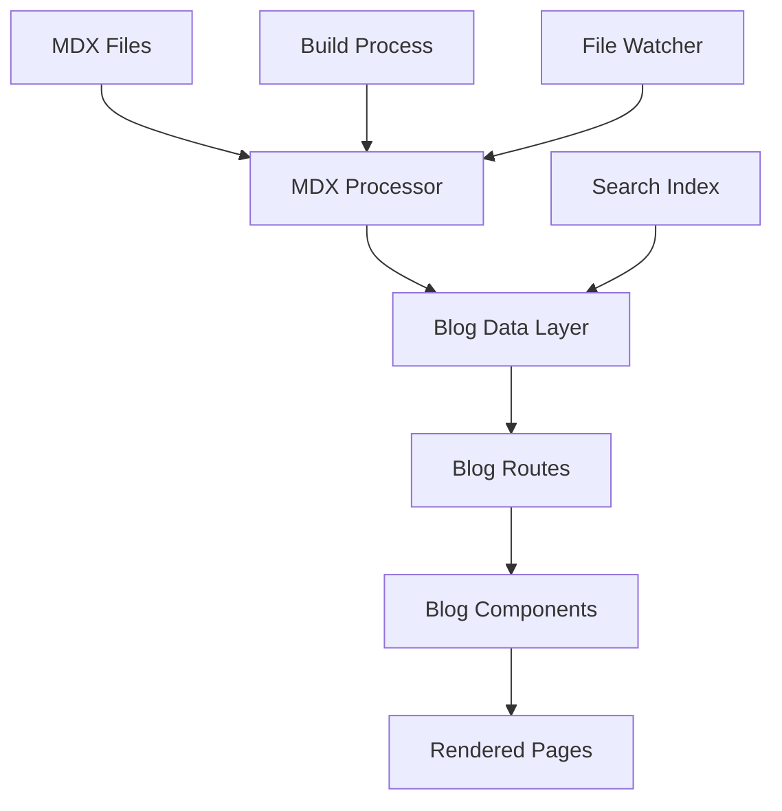

# Design Document

## Overview

El sistema de blogging MDX se integrará con la aplicación React Router existente, aprovechando las capacidades de SSR y prerendering. El sistema utilizará archivos MDX almacenados en el sistema de archivos, procesados en tiempo de construcción y servidos de manera optimizada.

La arquitectura utilizará el sistema de rutas existente de React Router, donde los archivos MDX representan el contenido de las entradas de blog, con metadatos extraídos del frontmatter y contenido procesado con componentes React embebidos. Las rutas se definirán en el archivo routes.ts existente.

## Architecture

### High-Level Architecture



### File Structure

```
app/
├── .server/
│   └── blog/
│       ├── mdx-processor.ts     # Procesamiento de archivos MDX
│       ├── blog-data.ts         # Capa de datos del blog
│       └── search.ts            # Funcionalidad de búsqueda
├── routes/
│   ├── blog.tsx                 # Lista de entradas (ya existe)
│   └── blog/
│       ├── BlogList.tsx         # Componente de lista (ya existe)
│       ├── post.tsx             # Página individual de entrada (/blog/:slug)
│       └── components/          # Componentes reutilizables
├── content/
│   └── blog/
│       ├── 2025-01-15-primer-post.mdx
│       ├── 2025-01-20-segundo-post.mdx
│       └── assets/              # Imágenes y recursos
└── components/
    └── mdx/                     # Componentes para usar en MDX
        ├── CodeBlock.tsx
        ├── Callout.tsx
        └── ImageGallery.tsx
```

## Components and Interfaces

### MDX Processor

```typescript
interface BlogPost {
  slug: string;
  title: string;
  description: string;
  date: string;
  author: string;
  tags: string[];
  featuredImage?: string;
  readingTime: number;
  content: string;
  excerpt: string;
}

interface BlogMetadata {
  title: string;
  description: string;
  date: string;
  author: string;
  tags: string[];
  featuredImage?: string;
  published?: boolean;
}

class MDXProcessor {
  static async processFile(filePath: string): Promise<BlogPost>;
  static async getAllPosts(): Promise<BlogPost[]>;
  static async getPostBySlug(slug: string): Promise<BlogPost | null>;
  static generateExcerpt(content: string): string;
  static calculateReadingTime(content: string): number;
}
```

### Blog Data Layer

```typescript
interface BlogDataService {
  getAllPosts(options?: {
    page?: number;
    limit?: number;
    tag?: string;
    search?: string;
  }): Promise<{
    posts: BlogPost[];
    totalPages: number;
    currentPage: number;
  }>;

  getPostBySlug(slug: string): Promise<BlogPost | null>;
  getRelatedPosts(slug: string, limit?: number): Promise<BlogPost[]>;
  searchPosts(query: string): Promise<BlogPost[]>;
  getPostsByTag(tag: string): Promise<BlogPost[]>;
  getAllTags(): Promise<string[]>;
}
```

### Route Loaders

```typescript
// app/routes/blog.tsx
export async function loader({ request }: LoaderFunctionArgs) {
  const url = new URL(request.url);
  const page = parseInt(url.searchParams.get("page") || "1");
  const tag = url.searchParams.get("tag") || undefined;
  const search = url.searchParams.get("search") || undefined;

  const { posts, totalPages, currentPage } = await blogDataService.getAllPosts({
    page,
    tag,
    search,
    limit: 10,
  });

  return json({
    posts,
    totalPages,
    currentPage,
    tags: await blogDataService.getAllTags(),
  });
}

// app/routes/blog.$slug.tsx
export async function loader({ params }: LoaderFunctionArgs) {
  const post = await blogDataService.getPostBySlug(params.slug!);
  if (!post) throw new Response("Not Found", { status: 404 });

  const relatedPosts = await blogDataService.getRelatedPosts(params.slug!, 3);
  return json({ post, relatedPosts });
}
```

## Data Models

### MDX Frontmatter Schema

```yaml
---
title: "Título del Post"
description: "Descripción breve del contenido"
date: "2025-01-15"
author: "Nombre del Autor"
tags: ["react", "typescript", "tutorial"]
featuredImage: "/blog/assets/imagen-destacada.jpg"
published: true
---
```

### File Naming Convention

Los archivos MDX seguirán el patrón: `YYYY-MM-DD-slug.mdx`

Ejemplos:

- `2025-01-15-introduccion-a-react.mdx`
- `2025-01-20-optimizacion-de-performance.mdx`

### Search Index Structure

```typescript
interface SearchIndex {
  slug: string;
  title: string;
  description: string;
  content: string; // Contenido sin markdown para búsqueda
  tags: string[];
  author: string;
  date: string;
}
```

## Error Handling

### MDX Processing Errors

1. **Syntax Errors**: Capturar errores de compilación MDX y mostrar mensajes descriptivos
2. **Missing Frontmatter**: Validar que todos los campos requeridos estén presentes
3. **Invalid Dates**: Validar formato de fechas y ordenamiento
4. **Missing Files**: Manejar referencias a imágenes o archivos inexistentes

```typescript
class BlogError extends Error {
  constructor(
    message: string,
    public type:
      | "SYNTAX_ERROR"
      | "MISSING_FRONTMATTER"
      | "INVALID_DATE"
      | "FILE_NOT_FOUND",
    public filePath?: string
  ) {
    super(message);
  }
}
```

### Runtime Error Handling

1. **404 para posts inexistentes**: Redirigir a página de error personalizada
2. **Errores de renderizado**: Fallback a versión sin componentes React
3. **Errores de búsqueda**: Mostrar mensaje de error amigable

## Testing Strategy

### Unit Tests

1. **MDX Processor Tests**

   - Procesamiento correcto de frontmatter
   - Generación de excerpts
   - Cálculo de tiempo de lectura
   - Manejo de errores de sintaxis

2. **Blog Data Service Tests**
   - Paginación correcta
   - Filtrado por tags
   - Funcionalidad de búsqueda
   - Ordenamiento por fecha

### Integration Tests

1. **Route Tests**

   - Carga correcta de lista de posts
   - Navegación a posts individuales
   - Manejo de parámetros de URL
   - Respuestas 404 apropiadas

2. **Component Tests**
   - Renderizado de componentes MDX
   - Interactividad de componentes embebidos
   - Responsive design

### Performance Tests

1. **Build Time Tests**

   - Tiempo de procesamiento de archivos MDX
   - Generación de índices de búsqueda
   - Optimización de imágenes

2. **Runtime Performance Tests**
   - Tiempo de carga de páginas
   - Lazy loading de imágenes
   - Prefetching de rutas

## SEO and Performance Optimizations

### Meta Tags Generation

```typescript
export function generateMetaTags(post: BlogPost) {
  return {
    title: post.title,
    description: post.description,
    "og:title": post.title,
    "og:description": post.description,
    "og:image": post.featuredImage || "/default-blog-image.jpg",
    "og:type": "article",
    "article:author": post.author,
    "article:published_time": post.date,
    "article:tag": post.tags,
    keywords: post.tags.join(", "),
  };
}
```

### Prerendering Strategy

```typescript
// react-router.config.ts
export default {
  ssr: true,
  prerender: async () => {
    const posts = await blogDataService.getAllPosts();
    const blogRoutes = posts.posts.map((post) => `/blog/${post.slug}`);
    return ["/blog", ...blogRoutes];
  },
} satisfies Config;
```

### Image Optimization

1. **Lazy Loading**: Implementar lazy loading para imágenes en posts
2. **Responsive Images**: Generar múltiples tamaños para diferentes dispositivos
3. **WebP Conversion**: Convertir imágenes a formato WebP automáticamente

### Code Splitting

1. **Route-based Splitting**: Cada ruta de blog se carga independientemente
2. **Component Splitting**: Componentes MDX se cargan bajo demanda
3. **Syntax Highlighting**: Cargar librerías de highlighting solo cuando se necesiten

## Integration Points

### Existing Components

El sistema reutilizará componentes existentes:

- `AuthNav` para navegación
- `Footer` para pie de página
- `FloatingChat` para chat flotante
- Componentes de `app/components/common/` para UI consistente

### Styling Integration

Mantener consistencia con el sistema de diseño existente:

- Usar clases de Tailwind existentes
- Mantener el estilo "brutal" con bordes negros
- Reutilizar componentes como `BlogCard` y `BlogHeader`

### Search Integration

Integrar con el sistema de búsqueda existente si lo hay, o implementar uno nuevo que sea consistente con el diseño actual.
